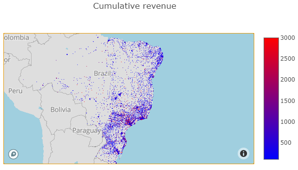

# Olist Customer Segmentation .
### Analysing of the E-Commerce company Olist dataset

## Business Understanding of Olist E-Commerce
This dataset was generously provided by Olist, the largest department store in Brazilian marketplaces. Olist connects small businesses from all over Brazil to channels without hassle and with a single contract. Those merchants are able to sell their products through the Olist Store and ship them directly to the customers using Olist logistics partners. See more on Olist's website: www.olist.com

After a customer purchases the product from Olist Store a seller gets notified to fulfill that order. Once the customer receives the product, or the estimated delivery date is due, the customer gets a satisfaction survey by email where he can give a note for the purchase experience and write down some comments.

## Market Segmentation
For the decision making process in business development in general, and potentially for the logistic strategy specifically, an understanding of the customer behaviour and geographic conditions need to be analyzed. By extracting commonly shared demographic- and geodemographic characteristics methods are used to divide customers into groups (segments). This allows to apply tailor-made strategies that can target specific customer segments in a more effective way.

## Objectives

The analysis in this repository is looking into the customer's buying behaviour as well as their locations. Three different approaches to segment customers is presented: Customer Segmentation, RFM Analysis and K-Means Clustering. By doing so a few quesions will be answered:

- Demographic relationship between customers

- Geographic relationship in view of customer characteristics

- Strategy to target specific customer segments

- What are the conclusions for the logistic process?

## libraries:

- python
- numpy
- pandas
- datetime
- re
- sklearn
- matplotlib
- seaborn
- plotly
- waffle

## Data Understanding 
The data is divided in multiple datasets for better understanding and organization:

There is also a prepared dataset (df_orders_consolidated.csv) available as an output of the initial Olist E-commerce Data Analysis:

For the current analysis following data files are used:

- df_orders_consolidated.csv
- olist_customers_dataset.csv
- olist_geolocation_dataset.csv

## Prepare Data

The following steps have been processed in this analysis:

- Understanding the dataset
- Checking for missing values 
- Checking for duplicates
- Checking data formats: Converted date columns to datetime format
- Zip code - coordinates (latitude and longitude)
- Only orders with status delivered were filtered

## Exploratory Data Analysis

*Goal*: The focus is on getting an understanding about the customer's buying habits and their locations.

Where are the customers from?

Customers live in 4,119 unique cities in 27 unique states.

The imbalanced distribution accross cities and states need to be kept in mind when drawing conclusions of statistical nature.

There are 14,994 unique zip code prefixes.

*When did customers join?*

The date of the first order is assumed to be the user sign-up date.

Many new cutomers appeared on Black Friday! It is interesting to see that the impact is not very pronounced when looking at the cumulative customer count for the total time span. Overall, the increase of customers has an upward trend. The trendline is slightly exponential, which means that the growth is accelerating slowly.

# Customer segmentation

## Demographic relationship between customers

The segmentation will classify customers based on thre metrics:

- Date since last order was placed (Recency)
- Total money spent
- 
The Recency segments are defined by dividing the total time period (oldest order to the newest order) in four periods. In that way we get the following classes:

- Inactive
- Cold
- Hot
- Active
- 
In a second step the total purchase amount of a customer was sorted to either, higher than the median total purchase amount or lower. Doing so produces two classes:

- Low
- High

The two classes were combined for each customer to a sub-segment. The disctibution can be made visible in a tree map or waffle chart. The distribution can be reviewed accoring a range of different KPIs.

### Conclusion: Demographic relationship between customers

- The strongest class of the 7 generated sub-segments is active customers with high spending, followed by "hot" customers which high spending, which is a good sign for the business.
- Active customers with high and low spending placed the most orders, followed by "hot" customers.
- Active customers are also the biggest groups in terms of head count.
- Inactive customers represent in each chart the smallest proportion.

# Geodemographic Segmentation

### Geographic relationship in view of customer characteristics

As mentioned above, there is no direct link between the coordinates (logitude, latitude) and the customer, because the zip code prefix is not uniquely assigned to one specific coordinate, but a range which fall into the same neighborhood. In this way many customers fall onto the same coordinate. To deal with this, for each coordinate the majority class was calculated. In that way the unique zip code prefix is shown on the map with the color of the majority segment.

Distribution of sub-sebments

The bright red dots represent the active-high sub-segment. The color shifts to the cold- and inactive segments in the blue colors. With exception of a few pockets, there's a relatively evenly disctibution of the sub-segments accross the East of Brazil.

Distribution according total revenue

The chart shows that there is some clustering between higher revenue and lower revenue areas, especially if setting the lower bound threshold higher. In neighborhoods of "Campinas" mostly higher total values while in the suburbs "Vila Amelia", "Brasilandia" and "Limao District" mostly lower values dominate. Rio de Janeiro, especially around the waterfront is mostly red (high revenue), while the north-western suburbs are mainly blue (low revenue).

Even so we can identify areas of higher interest for the business, we need to be careful with the interpretation on an individual level:

As seen in the EDA section, some zip codes have more customers assigned, so a high total value can be an effect of a big group size, and therefore a higher acumulated revenue. As a refresher, a box chart to display the statistical distribution of the group sizes:

To have the real distribution of the total revenue accross zip codes from another perspective:

A big majority of neighborhoods is on the low end of the distribution when looking at the summarized revenue. This can have different reasons:

- Small group size
- Low purchase values
- a combination of the two

### Distribution according average purchase value

The following visualization shows the distribution on an individual level, independent from the zize of a neighborhood.

By adjusting the lower- and uppder band of the color scale it can be seen that there's a general tendency of lower purchase prices in the South of Brazil while higher purchase prices are more existing in the North. The effect is not very pronounced but still visible. A significance test to statistically prove that this difference has sufficient evindence would need to be done in case this will be considered important in the final business case.

The general disctribution of individual purchase values averaged accross zip codes

Above chart shows the average purchase value distribution, averaged over zip codes. It shows a right-skewed distribution with the majority of the purchase values in the range of 100-120. This seems also to be in line with the general product cost distribution (reference EDA analysis in "Olist Business Trend Analysis").

## Conclusion: Geographic relationship in view of customer characteristics

- There is not a clear correlation between location and customer sub-segment.
- Along the cost line of Rio de Janeiro are the biggest communities, which also falls in line with areas of high revenue. On the other hand, Sao Paulo has, by a big margin, the biggest overall customer count. This is an important conclusion for logistics and supply chain.
- Some level of clustering in view of higher- and lower total reveny can be seen. This might for a big part be the effect of the group sizes. Geographical clusters of high revenue are "Campinas" and the south east of Rio de Janeiro.
- There seem to be a slightly higher general purchase price in the north of Brazil when looking at the level of individual customers. A statistical test to validate this statement would need to be performed before basing any decisions on this.

