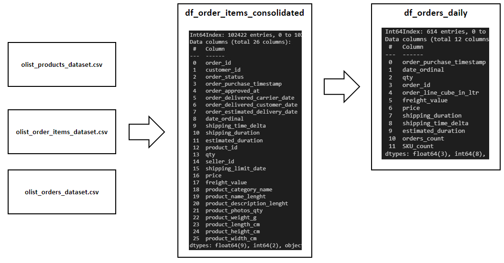

# Olist Customer Segmentation 
### Analysing of the E-Commerce company Olist dataset

## Business Understanding of Olist E-Commerce
This dataset was generously provided by Olist, the largest department store in Brazilian marketplaces. Olist connects small businesses from all over Brazil to channels without hassle and with a single contract. Those merchants are able to sell their products through the Olist Store and ship them directly to the customers using Olist logistics partners. See more on Olist's website: www.olist.com

After a customer purchases the product from Olist Store a seller gets notified to fulfill that order. Once the customer receives the product, or the estimated delivery date is due, the customer gets a satisfaction survey by email where he can give a note for the purchase experience and write down some comments.

## Market Segmentation
For the decision making process in business development in general, and potentially for the logistic strategy specifically, an understanding of the customer behaviour and geographic conditions need to be analyzed. By extracting commonly shared demographic- and geodemographic characteristics methods are used to divide customers into groups (segments). This allows to apply tailor-made strategies that can target specific customer segments in a more effective way.

## Objectives

This analysis is taking a look into the buying behaviour and the location of Olist's customers. Three different approaches to segment customers is presented: customer segmentation, RFM Analysis and K-Means clustering. The following points will be answered:

- Demographic relationship between Olist's customers

- Geographic relationship in view of Olist's customer characteristics

- A Strategy to target specific customer segments

- And a conclusions derived for the logistic perspective 

## libraries:

- python
- numpy
- pandas
- datetime
- re
- sklearn
- matplotlib
- seaborn
- plotly
- waffle

## Data Understanding 
The data is divided in multiple datasets for better understanding and organization:

There is also a prepared dataset (df_orders_consolidated.csv) available as an output of a previous analysis of Olist's business:

The following data files are used:

- df_orders_consolidated.csv
- olist_customers_dataset.csv
- olist_geolocation_dataset.csv

## Prepare Data

Steps that have been processed in this analysis:

- Understanding the dataset
- Checking for missing values 
- Checking for duplicates
- Checking data formats: Converted date columns to datetime format
- Zip code - coordinates (latitude and longitude)
- Only orders with status delivered were filtered

## Exploratory Data Analysis

The main goal is to get an understanding about the buying habits of Olist's customers and their location.

So, where are the customers from?

Olist's customers live in 4,119 (unique) cities in 27 (unique) states.

The distribution accross cities and states is imbalanced and need to be kept in mind when drawing conclusions.

There are 14,994 (unique) zip code prefixes.

So when did Olist's customers join?

We assume the sign-up date of a user to be the first time of an order.

Many new cutomers appeared on Black Friday ad it is interesting to see that the impact is not very pronounced, when looking at the cumulative customer count for the total time span. Overall, the increase of customers has an inclining trend. The trendline is slightly exponential, which means that the growth is accelerating slowly.

# Customer segmentation

## Demographic relationship between customers

The segmentation will classify customers based on the metrics:

- Date since last order was placed (Recency)
- Total money spent

The Recency segments are defined by dividing the total time period (oldest order to the newest order) in four periods. In that way we get the following classes:

- Inactive
- Cold
- Hot
- Active

The total amount spend of a customer was sorted to either, higher than the median total purchase amount or lower:

- Low
- High

These two classes were combined for each customer to a sub-segment. The disctibution has been visualized in a waffle chart. 
The distribution can be reviewed accoring a range of different KPIs.

### Conclusion: Demographic relationship between Olist's customers

- The strongest class of the sub-segments is active customers with high spending, followed by "hot" customers which are high spending. This is a good result for Olist's business.
- Active customers with high and low spending placed the highest amount of orders, followed by "hot" customers.
- Active customers are also the biggest groups in terms of head count.
- Inactive customers represent the smallest proportion in every chart.

# Geodemographic Segmentation

### Geographic relationship in view of customer characteristics

As mentioned, there isn't a direct link between the coordinates and the customer, because the zip code prefix is not uniquely assigned to one specific coordinate but a range which fall into the same neighborhood. In this way many customers fall into the same coordinate. Therefore the majority class was calculated for each coordinate. This is how the unique zip code prefix is shown on the map with the color of the majority segment.

Distribution of sub-segments

Bright red dots = active-high sub-segment.  
Color shift to blue colors = cold- and inactive segments. 
With exception of a few, there's a relatively equally disctibution of the sub-segments accross the East of Brazil.

Distribution according total revenue

The chart shows that there is some clustering between higher revenue and lower revenue areas, especially if setting the lower bound threshold higher. In neighborhoods of "Campinas" mostly higher total values while in the suburbs "Vila Amelia", "Brasilandia" and "Limao District" mostly lower values dominate. Rio de Janeiro, especially around the waterfront is mostly red (high revenue), while the north-western suburbs are mainly blue (low revenue).

Even so we can identify areas of higher interest for the business, we need to be careful with the interpretation on an individual level:

As seen in the EDA section, some zip codes have more customers assigned, so a high total value can be an effect of a big group size, and therefore a higher acumulated revenue. As a refresher, a box chart to display the statistical distribution of the group sizes:

To have the real distribution of the total revenue accross zip codes from another perspective:

A big majority of neighborhoods is on the low end of the distribution when looking at the summarized revenue. This can have different reasons:

- Small group size
- Low purchase values
- a combination of the two

### Distribution according average purchase value

The following visualization shows the distribution on an individual level, independent from the zize of a neighborhood.

By adjusting the lower- and uppder band of the color scale it can be seen that there's a general tendency of lower purchase prices in the South of Brazil while higher purchase prices are more existing in the North. The effect is not very pronounced but still visible. A significance test to statistically prove that this difference has sufficient evindence would need to be done in case this will be considered important in the final business case.

The general disctribution of individual purchase values averaged accross zip codes

Above chart shows the average purchase value distribution, averaged over zip codes. It shows a right-skewed distribution with the majority of the purchase values in the range of 100-120. 

In general most of the orders were placed in the range of 200-250 days after "day 0".

## Conclusion: Geographic relationship in view of customer characteristics

- No clear correlation between location and customer sub-segment
- The biggest communities along the cost line of Rio de Janeiro are areas of high revenue. Sao Paulo has the biggest overall customer count. This is an important fact for logistics and supply chain solutions.
- Some level of clustering in respect to higher- and lower total revenue can be seen. This might have a big portion on the effect of the group sizes. Geographical clusters of high revenue are "Campinas" and the south east of Rio.
- Slightly higher general price of purchase in the north of Brazil on an individual customer level. Before coming to any conclusions here this needs to be statistically tested.

# Part II

# RFM Analysis
## Strategy to target specific customer segments
The RFM analysis is another way to segment customers in order to develop marketing strategies. The three used metrics Recency, Frequency amd Monetary lead to a combined individual classification. With this classification also an appropriate proposed marketing strategy will be developed. The number of the sub-segments which is created in this process is arbitrary and might not be in line with an underlying clustering as it appears in the data. To address this, also K-Means Clustering is applied to extract clusters from non-labeled data. The features used as inputs are the same as used for the RFM analysis.

## Recency
Recency is the time duration from the last order to the reference date (last order date in data set in our case).

This chart makes sense because we see that there is the spike at round about 270 days before the reference day. That falls in the time period of the heavy Black Friday sales event where a lot of customers placed their latest order.

There are many customers which only placed one order. 

Monetary is basically the cumulated purchase amount a customer has spent.

As also seen in the "Market Trend Analysis", most of the purchases are on the low side (under 100) of the distribution.

In step one of the RFM segment process each of the labels Recency, Frequency and Monetary is individually calculated per customer. In step two, two metrics are developed:

1. RFM score: A calculated value with is the product of the three scores (R-score * F-score * M-score)
2. RFM segment label: A number code with is created by combining the three scoces in a row (R-scoreF-scoreM-score) In step three filter conditions based on the two metrics for customer types are defined. The segmentation process in this analysis is dealing with 7 customer types:

- Best Customer
- Big Spender
- Loyalist
- Potential Loyalist
- Hibernating
- Almost Lost
- Lost Customer

Based on the observed customer behaviour the appropriate marketing strategy added to a summarized list.

RFM Segment | Count |	Recency |	Frequency |	Monetary |	Marketing Strategy |
----------- | ----- | ------- | --------- | -------- | ------------------- |
Best customer |	6,552 |	66.6 | 1.2 | 356.4 | Personalized communication, offer loyalty program, no promotional offers needed |
Big Spender	| 5,715 |	172.9 |	1.1 |	346.3 |	Make them feel valued and offer quality products, encourage to stick with brands |
Loyalist	| 1,132 |	290.9 |	2.1 |	173.4 |	Offer loyalty program |
Potential Loyalists	| 51,001 | 184.2 |	1.0 |	136.7 |	Recommend products and offer discounts |
Hibernating |	5,803 |	446.5 |	1.0 |	64.8 |	Make great offers with big discounts |
Almost Lost |	11,581 |	360.9 |	1.0 |	88.8 |	Try to win them with limited sales promotions |
Lost Customer	| 11,574 |	367.6 |	1.0 |	29.0 |	Do not spent much effort and money to win them |

### Conclusion: Strategy to target specific customer segments

- The order frequency and order amounts are concentrated on the lower end. This is what we have repeatedly have seen before.
- The biggest RFM segment is the group of Potential Loyalists. These are customers that need to be targeted with offers and discounts in order to make the business successful. If Olist manages to do a good job by winning the majority of this sub-segment it would make a big impact in growth.
- There is a good base of Best Customers, which is good news for the business.
- Some effort needs to be spent to target hibernating customers and customers which are almost lost

# K-Means Clustering

## Evaluation of the RFM segmentation by comparison with ML clustering method

K-Means Clustering is a method that identifies clusters within unlabeled data. Sklearns K-means algorithm has been applied to find underlying segments which are different from the randomly chosen RFM classes. This will provide a different perspective and confidence level on the RFM segmentation.

A scatter plot often helps to identify clustering visually before processing the data. The current analysis is dealing with three features which can already be visualized in a 3D scatter plot.

The scatter plot shows a zoomed view to get a clearer picture without the outliers. The major segmentation factor in this scatter plot is generated by the purchase frequency. Beside this and the small cluster of very early customers (in the range of 700 days Recency), there is not a clear segmentation to be identified.

The Sum of Squared Errors in K-Means Clustering depends on the number of selected clusters. The goal is to select a number of clusters as small as possible, which still archives a significant improvemet if fitting the data. The process is known as "Elbow Method".

A range of 1 to 10 clusters is used to calculate the resulting Sum of Squared Errors.

The chart pictures that a cluster amount of 4 is a good choice. When K-Means is applied for 4 clusters we can see where the borders were defined. 
The table below and the pie charts show the new clustering.

K-Means |  Cluster |	Recency |	Frequency |	Monetary |	Count |	Customer | Description |
----- | -------- | -------- | --------- | -------- | ------- | -------- | ---------- |
0 |	127.8 |	1.0 |	113.4 |	50,832 |	New Low-Spenders |
1 |	219.9 |	2.1 |	243.2 |	2,774 |	Loyalists |
2 |	387.2 |	1.0 |	114.1 |	37,566 |	Hibernating Low-Spenders |
3 |	237.1 |	1.0 |	1142.7 |	2,186 |	Big Spenders |

Big Spenders are a small portion of customers, but their revenue impact is very high. It is essential for Olist to make these customers feel valued and to encourage them to stick with them. New Low Spenders are the biggest group but show a relatively small revenue. For the growth of Olist it is important to spend a lot effort in these customers in order to turn them into Loyalists or Big Spenders.

The relation between these clusters to each other can again be shown in a 3D scatter plot.

But how do these new classes geologically relate?

No general tendency to be observe when looking at Brazil in total but zooming into the major cities shows local clustering.

The color coding visualizes that a big portion of Sao Paulo's neighbourhoods are Hibernating Low-Spenders. Compared to this, it seems that Rio de Janeiro has more New Low-Spenders. There isn't a clearly visible concentration of the important segment of Big Spenders when zooming through Brazil.

# Conclusion

## Demographic relationship between customers

The common results between the segmentation methods is a small group of High Spenders which is the key group of customers to maintain as they are representing a significant portion of the revenue and a relatively large group of customers which have the potential to impact Olist's future business. A very small segment can be called "Loyalists" based on multiple orders placed.

The Order frequency in the dataset is generally low with a high concentration of one single order. Therefore "inactive" is a very sensitive metric which can swing quickly based on the set threshold. The segmentation and the RMF in this analysis didn't work with normalized data and show a smaller portion of "inactive", "hibernating" and "lost" customers. K-Means Clustering worked with normalized data and came up with only 4 customer clusters, in which "Hibernating Low-Spenders" are 40% of all customers.

## Geographic relationship in view of customer characteristics

There is a big imbalance in the customers location. Most of the customers live in Sau Paulo. This must impact statistical validations and decisions to target Olist's business development.

The geological distribution of the defined RFM segments across Brazil seems to be random. Though the K-Means segments indicate some local clustering which would be nice to further be investigated with statistical methods. Big parts of Sao Paulo show "Hibernating Low-Spenders" while bigger portions of Rio de Janeiro show "New Low-Spenders". Regarding cumulated revenue there seems to be some local clustering. The south-east of Rio de Janeiro and "Campinas" show a higher density of higher cumulated revenue. This might have impaceted by residential density which is confirmed by individual total value. The colors which indicate average individual purchase value show that  northern parts of Brazil tend to spend more on their purchase. Also this need further statistical validation.

## Strategy to target specific customer segments

Combines with the segmentation of customers a table with marketing strategies has been derived. These strategies need to be seen in the light of the segment's importance too. As stated "High Spenders" and the big group of "Potential Loyalists" (or "New Low-Spenders") are quite important. Therefore a marketing strategy to target this segment has a higher priority.

## Conclusions for Olist's logistic process

As analysed during the first Udacity project, the shipping duration is varying and somehow correlating with the costs of the product. While the correlation between shipping time and for instance customer satisfaction hasn't investigated yet, it can be concluded from the above geodemographic analysis that some areas have a higher relevance. The possibility of micro fullfillment centers for direct shippment vz. drop-off shipment, close to those dense areas could be a business case for Olist's business development plan. These centers would be part of a new hybrid concept for Olist, in which the "hot" product groups would be logistically incorporated to achive an effective supply chain for the very important High Spenders and Loyalist segment. Due to the small product sizes within this group a small facility footprint could be maintained, which helps to facilitate the warehouse process and keeps the ROI low. A bigger portion of Olists business would still be executed via drop-off shipment as of today. This helps to serve a large group of Potential Loyalists (or New Low-Spenders) more effectively.

## Next steps

For a further analysis it would be interesting to derive logistical concepts for Olist's warehouses. The order structure, amount of order lines, daily workload, marketing strategies etc. would be taken into account to develop the best ratio between automated/ manuel storage and picking strategies. This would be analysed due to the material handling portfolio and their specifics of different suppliers on the market. 
